## Overview

The Analytics module performs a complete end-to-end analysis of the Titanic dataset, beginning with exploratory data analysis (EDA) and progressing through predictive modeling. The workflow includes dataset profiling, data cleaning, visualization, statistical analysis, feature engineering, classification, regression, hyperparameter tuning, model evaluation, and model persistence.

The module is divided into two major parts:

- **Part A – Exploratory Data Analysis:** Focuses on understanding the dataset through profiling, cleaning, visualization, statistical analysis, and feature exploration.
- **Part B – Predictive Modeling:** Builds machine learning models using the cleaned dataset, evaluates multiple algorithms, investigates class imbalance, performs hyperparameter tuning, develops a regression model, and saves the best-performing machine learning pipeline for future inference.

Together, these two parts provide a complete analytics workflow from raw data exploration to deployable machine learning models.

---

## Objectives

- Load and profile the Titanic dataset.
- Handle missing values using threshold-based preprocessing rules.
- Perform exploratory data analysis through univariate, bivariate, and multivariate visualizations.
- Detect outliers using the IQR method.
- Analyze feature relationships using correlation analysis.
- Standardize numerical features for exploratory purposes.
- Build multiple machine learning classification models.
- Compare classifier performance using standard evaluation metrics.
- Investigate class imbalance handling techniques.
- Perform hyperparameter tuning using GridSearchCV.
- Develop a multivariate linear regression model.
- Persist the complete machine learning pipeline using Joblib for future inference.

---

# Project Structure

```text
analytics/
│
├── data/
│   ├── raw/
│   └── processed/
│
├── models/
│
├── outputs/
│   ├── plots/
│   └── tables/
│
├── src/
│   ├── loader.py
│   ├── cleaner.py
│   ├── preprocessing.py
│   ├── eda.py
│   ├── classification.py
│   ├── evaluate.py
│   ├── imbalance.py
│   ├── model_selection.py
│   ├── regression.py
│   ├── model_persistence.py
│   ├── utils.py
│   └── main.py
│
├── README.md
└── requirements.txt
```

---

# Part A — Exploratory Data Analysis

Part A focuses on understanding the Titanic dataset before any machine learning models are developed. The dataset is profiled, cleaned, analyzed statistically, and visualized to identify important relationships between passenger characteristics and survival. These exploratory findings guide the preprocessing and modeling decisions implemented later in Part B.

---

# Dataset

| Property | Value |
|----------|-------|
| Dataset | Titanic |
| Source | Seaborn (`sns.load_dataset("titanic")`) |
| Original Shape | **891 Rows × 15 Columns** |

The dataset is loaded only once using the Seaborn library and immediately saved locally as:

```text
analytics/data/raw/titanic.csv
```

This offline copy ensures that the project remains reproducible even if the Seaborn dataset is unavailable during grading.

---

# Dataset Profiling

Immediately after loading, the dataset was profiled using:

- `df.shape`
- `df.info()`
- `df.describe()`

The profiling step provides:

- Dataset dimensions
- Feature data types
- Missing values
- Statistical summary of numerical features

---

# Missing Value Analysis

The percentage of missing values was computed for every column containing missing data.

| Column | Missing Values | Missing Percentage | Strategy |
|---------|---------------:|-------------------:|----------|
| deck | 688 | 77.22% | Drop Column |
| age | 177 | 19.87% | Median Imputation |
| embarked | 2 | 0.22% | Drop Rows |
| embark_town | 2 | 0.22% | Drop Rows |

---

## Missing Value Handling Decisions

### deck (77.22%)

The `deck` column contains **77.22%** missing values, making imputation unreliable. Since more than three-quarters of the observations are unavailable, retaining this feature would introduce substantial uncertainty into the analysis. Therefore, the column was removed from the cleaned dataset.

### age (19.87%)

The `age` column contains **19.87%** missing values, which falls within the assignment's **5%–30%** threshold. Median imputation was selected because the median is less sensitive to extreme values than the mean and provides a robust estimate for numerical data.

### embarked (0.22%)

Only **0.22%** of the observations are missing. Since the missing percentage is below **5%**, the affected rows were removed without significantly impacting the dataset.

### embark_town (0.22%)

The `embark_town` column also contains only **0.22%** missing values. Removing these rows has a negligible effect on the dataset while satisfying the assignment's threshold rule.

---

# Cleaned Dataset

After applying all preprocessing steps:

| Property | Value |
|----------|-------|
| Rows | **889** |
| Columns | **14** |

Cleaning operations performed:

- Removed the `deck` column.
- Imputed missing values in `age` using the median.
- Removed rows containing missing values in `embarked`.
- Removed rows containing missing values in `embark_town`.

The cleaned dataset is stored as:

```text
analytics/data/processed/titanic_cleaned.csv
```

---

# Univariate Analysis

Histograms and box plots were generated for the following numerical features:

- Age
- Fare

---

## Outlier Detection (IQR Rule)

Outliers were identified using the Interquartile Range (IQR) rule.

```text
Lower Bound = Q1 − 1.5 × IQR

Upper Bound = Q3 + 1.5 × IQR
```

### Outlier Summary

| Feature | Outliers |
|----------|----------:|
| Age | **65** |
| Fare | **114** |

---

### Age Distribution

<p align="center">
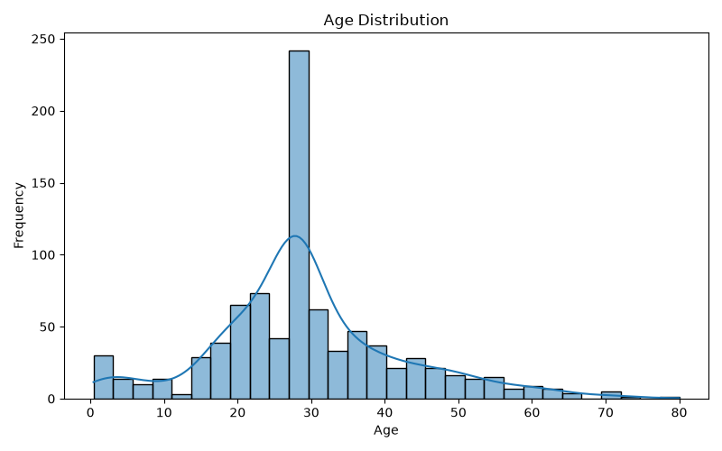
</p>

The histogram shows that most passengers were between 20 and 40 years of age. The distribution is moderately right-skewed due to a smaller number of elderly passengers. The accompanying box plot confirms the presence of several age-related outliers identified using the IQR rule.

---

### Fare Distribution

<p align="center">
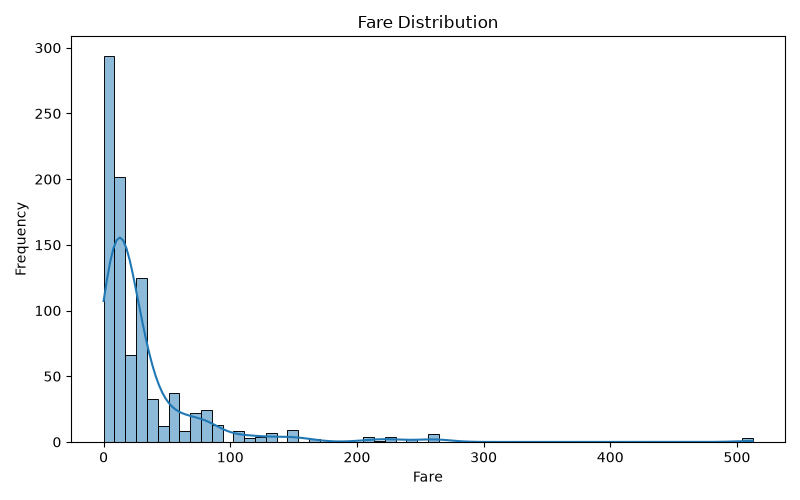
</p>

The fare distribution is highly right-skewed, with most passengers paying relatively low ticket prices while a small number paid exceptionally high fares. These expensive tickets increase the mean substantially compared to the median. The box plot also highlights several high-fare outliers.

---

## Fare Statistics

| Statistic | Value |
|-----------|------:|
| Mean | **32.10** |
| Median | **14.45** |
| Mode | **8.05** |

### Distribution Interpretation

Since:

```text
Mean > Median > Mode
```

the fare distribution is **right-skewed**. A small number of extremely expensive tickets pull the mean upward while the majority of passengers paid considerably lower fares.

---

# Bivariate Analysis

Boolean masking using `&` operators was used to compute survival rates for different passenger groups.

---

## Survival Rate by Sex

| Sex | Survival Rate |
|------|--------------:|
| Male | **18.89%** |
| Female | **74.04%** |

<p align="center">
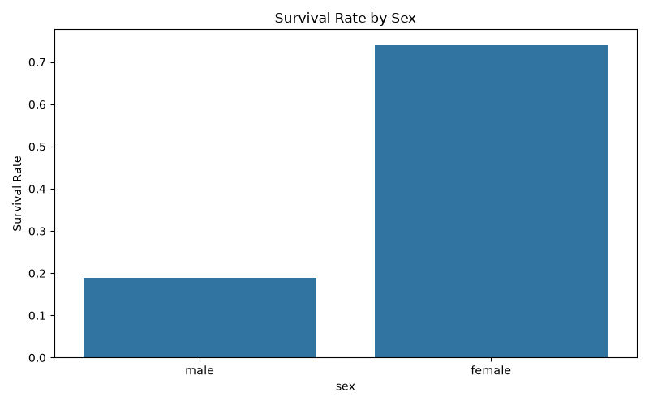
</p>

Female passengers experienced a substantially higher survival rate than male passengers. This indicates that gender was one of the strongest factors associated with survival on the Titanic. The results support the historical observation that women were generally given higher priority during evacuation, leading to significantly better survival outcomes.

---

## Survival Rate by Passenger Class

| Passenger Class | Survival Rate |
|-----------------|--------------:|
| First Class | **62.62%** |
| Second Class | **47.28%** |
| Third Class | **24.24%** |

<p align="center">
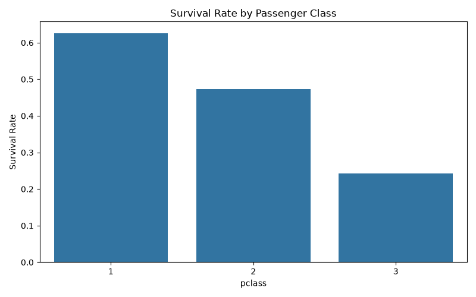
</p>

Passengers travelling in first class had the highest survival rate, while passengers in third class had the lowest. This suggests that passenger class had a significant influence on survival probability. Better cabin locations, easier access to lifeboats, and socioeconomic advantages may have contributed to the higher survival rates of first-class passengers.

---

## Survival Rate by Sex and Passenger Class

| Sex | Passenger Class | Survival Rate |
|------|-----------------|--------------:|
| Female | First | **96.74%** |
| Female | Second | **92.11%** |
| Female | Third | **50.00%** |
| Male | First | **36.89%** |
| Male | Second | **15.74%** |
| Male | Third | **13.54%** |

<p align="center">
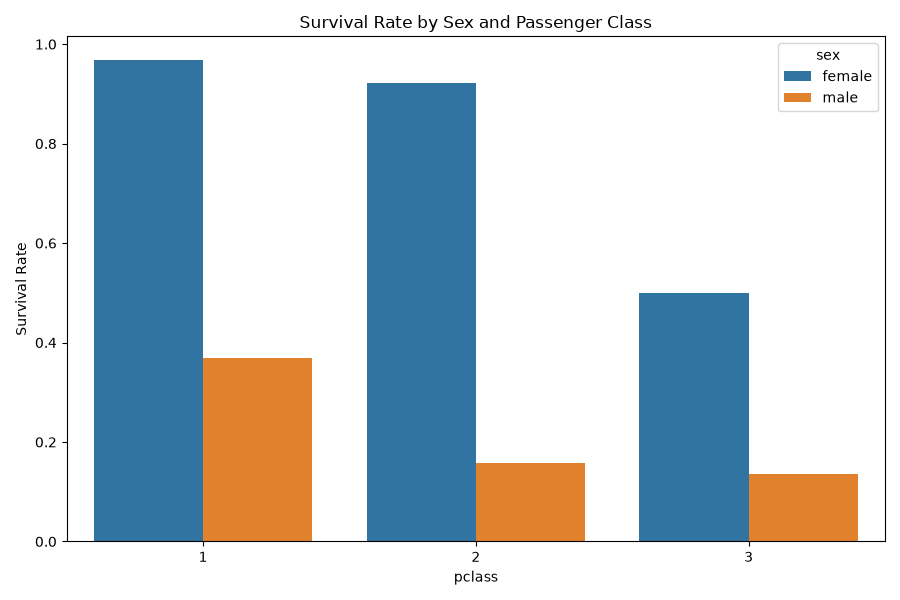
</p>

Combining gender and passenger class reveals an even clearer survival pattern. Women travelling in first and second class experienced exceptionally high survival rates, whereas men travelling in third class experienced the lowest survival rates. This suggests that survival was influenced by the combined effects of both gender and passenger class rather than either factor alone.

---

# Correlation Analysis

A correlation matrix was computed using only the following numerical features:

- survived
- pclass
- age
- sibsp
- parch
- fare

The boolean columns **adult_male** and **alone** were intentionally excluded because they are derived attributes rather than independent measured features.

<p align="center">
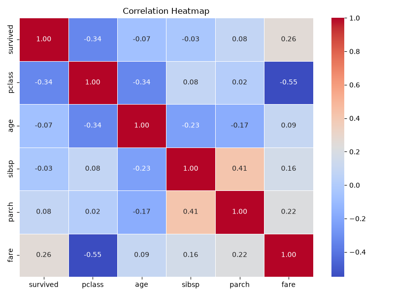
</p>

---

## Strongest Correlations

### 1. Passenger Class vs Fare

**Correlation Coefficient:** **-0.548**

Passenger class and fare exhibit the strongest negative correlation in the dataset. Passengers travelling in first class generally paid significantly higher fares than passengers travelling in lower classes. Since passenger class is numerically encoded as 1 (First Class), 2 (Second Class), and 3 (Third Class), higher class numbers correspond to lower ticket prices, resulting in a negative correlation.

---

### 2. SibSp vs Parch

**Correlation Coefficient:** **0.415**

The number of siblings/spouses (`sibsp`) is moderately positively correlated with the number of parents/children (`parch`) travelling together. Families often travelled as groups, making it common for passengers to have both sibling/spouse and parent/child relationships onboard. Consequently, increases in one family-related feature are often accompanied by increases in the other.

---

# Multivariate Data Story

To better understand the factors influencing passenger survival, four multivariate visualizations were created. Together, these charts demonstrate how gender, passenger class, age, and fare contributed to survival outcomes.

---

## Chart 1 — Survival by Sex

<p align="center">
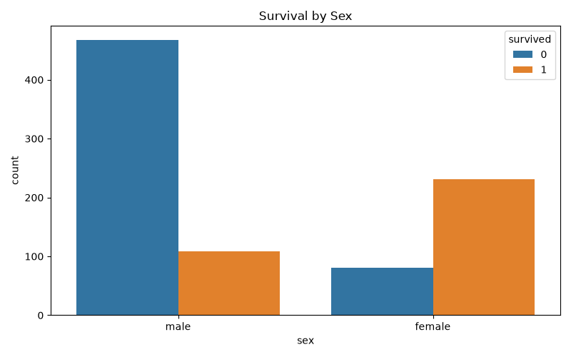
</p>

Female passengers experienced substantially higher survival rates than male passengers. This suggests that gender was one of the most influential factors affecting survival during the disaster. The visualization supports the historical evacuation policy that prioritized women, resulting in significantly higher survival probabilities.

---

## Chart 2 — Survival by Passenger Class

<p align="center">
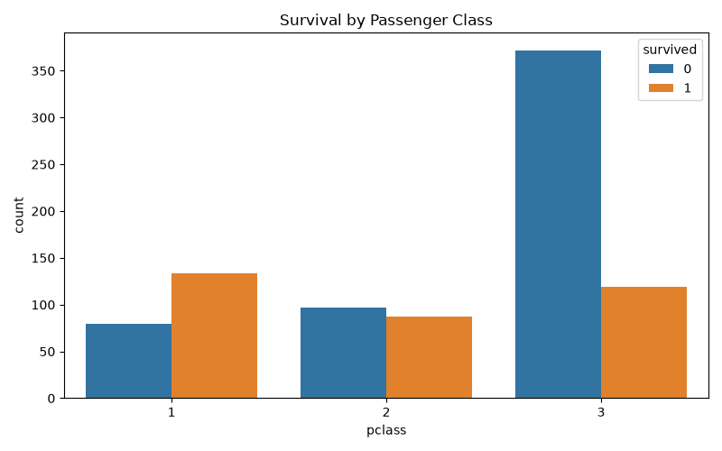
</p>

Passengers travelling in first class were considerably more likely to survive than passengers travelling in third class. This indicates that socioeconomic status and cabin location likely influenced access to lifeboats and emergency assistance. The chart clearly demonstrates that survival probability decreased as passenger class decreased.

---

## Chart 3 — Age vs Fare (Colored by Survival)

<p align="center">
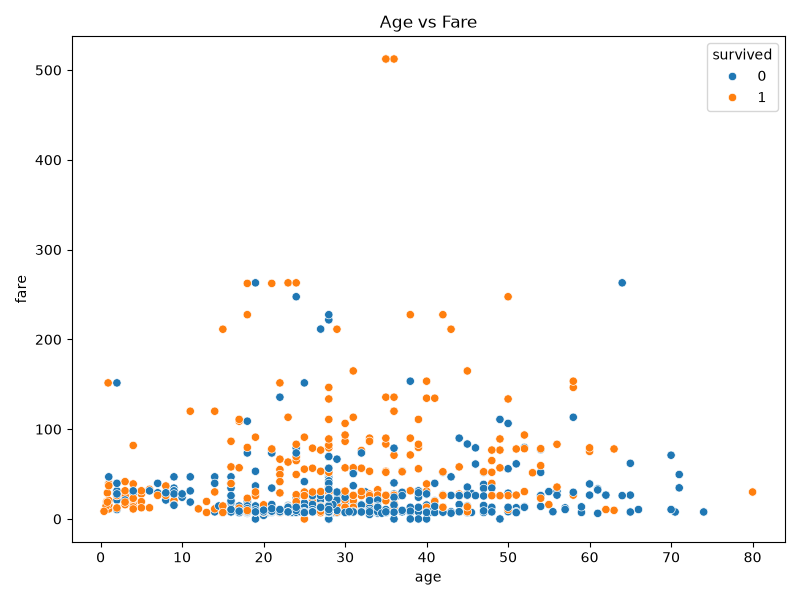
</p>

The scatter plot illustrates the relationship between passenger age, ticket fare, and survival. Passengers paying higher fares were generally associated with higher survival rates, reflecting the relationship between fare and passenger class. Although survivors appear across all age groups, fare shows a stronger association with survival than age alone.

---

## Chart 4 — Age Distribution by Sex and Survival

<p align="center">
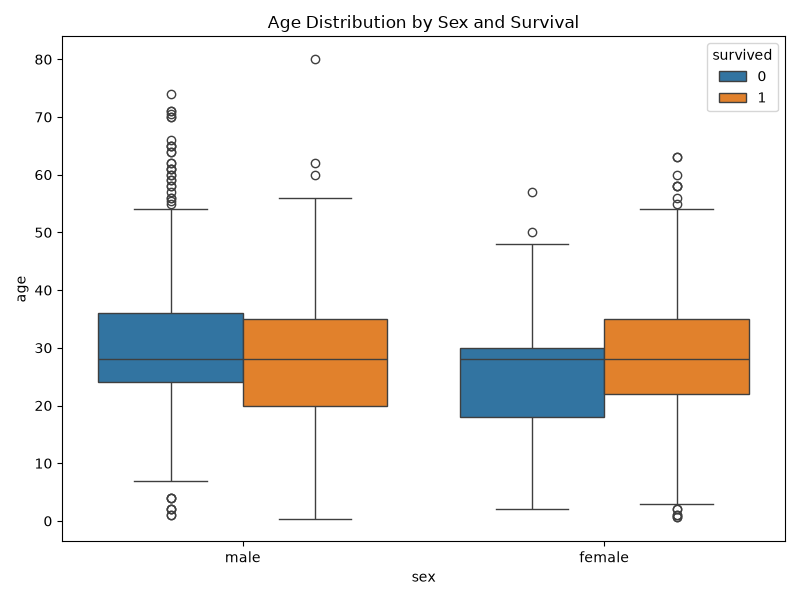
</p>

This visualization combines age, gender, and survival into a single chart. Female passengers maintained relatively high survival rates across different age groups, whereas male passengers experienced substantially lower survival rates regardless of age. These observations suggest that gender had a stronger influence on survival than age, although age still contributed to differences within each group.

---

# Exploratory Standardization Check

As an exploratory preprocessing step, the **Age** and **Fare** features were standardized using the Z-score formula:

```text
z = (x − mean) / std
```

This standardization was performed **only for exploratory analysis** and was **not used** in the machine learning pipeline. During model training, standardization will be performed separately using only the training dataset to avoid data leakage.

---

## Before Standardization

| Feature | Mean | Standard Deviation |
|----------|-----:|-------------------:|
| Age | 29.32 | 12.98 |
| Fare | 32.10 | 49.70 |

---

## After Standardization

| Feature | Mean | Standard Deviation |
|----------|-----:|-------------------:|
| Age | ≈ 0 | ≈ 1 |
| Fare | ≈ 0 | ≈ 1 |

The standardized features have means approximately equal to zero and standard deviations approximately equal to one, confirming that Z-score standardization was successfully applied.

---

### Age Distribution: Before vs After Standardization

<p align="center">
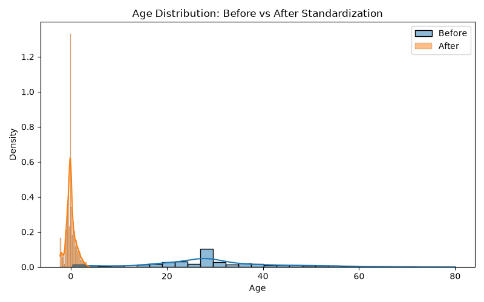
</p>

The standardized age distribution preserves the overall shape of the original distribution while shifting the mean to approximately zero and scaling the standard deviation to one. This confirms that standardization changes the scale of the data without altering its underlying distribution.

---

### Fare Distribution: Before vs After Standardization

<p align="center">
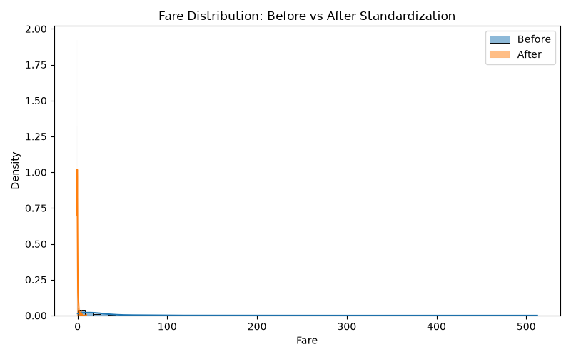
</p>

The standardized fare distribution also maintains the original right-skewed shape while rescaling the values around a mean of zero. Although the distribution remains skewed due to the presence of high-fare passengers, the transformed values are now suitable for algorithms that are sensitive to feature scaling.

---

# Part B — Predictive Modeling

Part B extends the exploratory analysis performed in Part A by developing machine learning models to predict passenger survival using the cleaned Titanic dataset. A complete end-to-end machine learning pipeline was implemented, covering data preprocessing, classification, model evaluation, imbalance handling, hyperparameter tuning, regression analysis, and model persistence.

The cleaned dataset generated in Part A was reused throughout this section. All preprocessing operations, including missing value imputation, categorical encoding, and feature scaling, were performed within Scikit-learn pipelines to ensure that every transformation was learned only from the training data. This prevents data leakage and allows the trained models to generalize reliably to unseen data.

---

# Train-Test Split

The cleaned dataset was divided into training and testing sets using an **80:20 stratified split**, with **survived** selected as the classification target.

## Dataset Split

| Dataset | Samples |
|----------|---------:|
| Training Set | **711** |
| Testing Set | **178** |

## Class Distribution

| Dataset | Not Survived | Survived |
|----------|-------------:|---------:|
| Training | **61.74%** | **38.26%** |
| Testing | **61.80%** | **38.20%** |

### Why Stratification?

Stratified sampling preserves the original class distribution in both the training and testing datasets. Since approximately **62%** of passengers did not survive while **38%** survived, maintaining these proportions ensures that both subsets accurately represent the original dataset. This reduces the risk of biased model evaluation and provides a more reliable estimate of how the models will perform on unseen data.

---

# Preprocessing Pipeline

A preprocessing pipeline was implemented using **ColumnTransformer** and **Pipeline** to prepare the dataset before model training.

## Numerical Features

| Columns | Preprocessing |
|---------|---------------|
| `age`, `sibsp`, `parch`, `fare`, `pclass` | Median Imputation → StandardScaler |

### Numerical Preprocessing

Missing values in numerical features were replaced using **median imputation** because the median is more robust to outliers than the mean. After imputation, all numerical features were standardized using **StandardScaler** to transform them to a common scale with approximately zero mean and unit variance.

---

## Categorical Features

| Columns | Preprocessing |
|---------|---------------|
| `sex`, `embarked` | Most Frequent Imputation → One-Hot Encoding |

### Categorical Preprocessing

Missing categorical values were imputed using the most frequently occurring category. The categorical features were then converted into numerical representations using **One-Hot Encoding**, allowing the machine learning models to process categorical information without introducing artificial ordinal relationships.

---

## Preventing Data Leakage

All preprocessing operations were fitted **only on the training dataset** and then applied to the testing dataset using **transform-only mode**. The preprocessing steps and machine learning estimator were combined into a single Scikit-learn **Pipeline**, ensuring that missing value imputation, feature encoding, and feature scaling were always performed consistently and without leaking information from the testing data into the training process.

# Classification Models

Three supervised machine learning algorithms were trained using the same stratified training and testing datasets. Every classifier was implemented as a Scikit-learn **Pipeline**, combining the preprocessing steps and the estimator into a single end-to-end workflow.

The following classification models were evaluated:

| Model | Purpose |
|--------|---------|
| Logistic Regression | Linear baseline classifier for binary classification |
| Decision Tree | Tree-based model capable of learning non-linear decision boundaries |
| Random Forest | Ensemble model that combines multiple decision trees to improve generalization and reduce overfitting |

---

## Decision Tree Visualization

The trained Decision Tree classifier was visualized using Scikit-learn's `plot_tree()` function.

<p align="center">
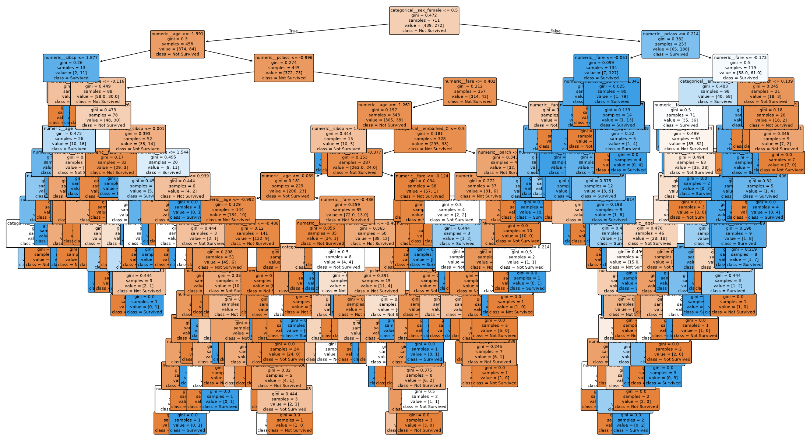
</p>

The visualization illustrates the learned decision rules, feature splits, class predictions, and impurity values throughout the tree. This provides an interpretable view of how the classifier makes survival predictions based on passenger characteristics.

---

# Model Evaluation

Each classifier was evaluated on the testing dataset using the following performance metrics:

- Accuracy
- Precision
- Recall
- F1 Score
- ROC Curve
- Area Under the ROC Curve (AUC)

Confusion matrices and ROC curves were generated for every model to provide a detailed assessment of classification performance.

---

## Classification Performance

| Model | Accuracy | Precision | Recall | F1 Score | AUC |
|--------|---------:|----------:|-------:|---------:|----:|
| Logistic Regression | **0.8090** | **0.7833** | **0.6912** | **0.7344** | **0.8610** |
| Decision Tree | **0.7640** | **0.6806** | **0.7206** | **0.7000** | **0.7496** |
| Random Forest | **0.7865** | **0.7419** | **0.6765** | **0.7077** | **0.8151** |
---

## Confusion Matrices

### Logistic Regression

<p align="center">
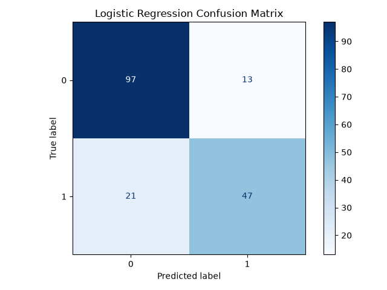
</p>

---

### Decision Tree

<p align="center">
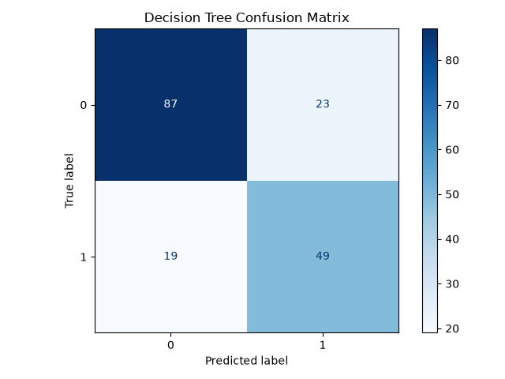
</p>

---

### Random Forest

<p align="center">
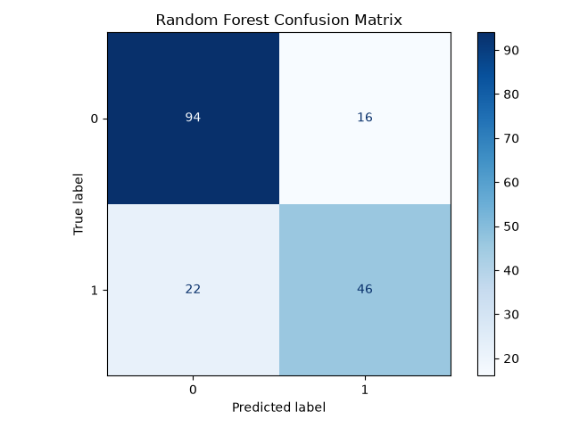
</p>

---

## ROC Curves

### Logistic Regression

<p align="center">
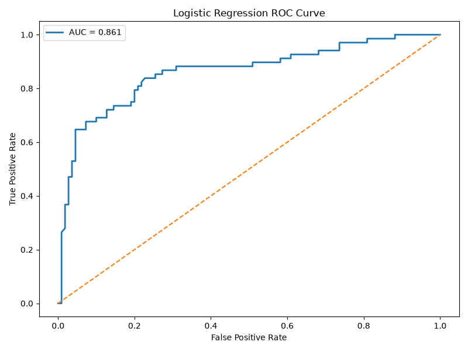
</p>

---

### Decision Tree

<p align="center">
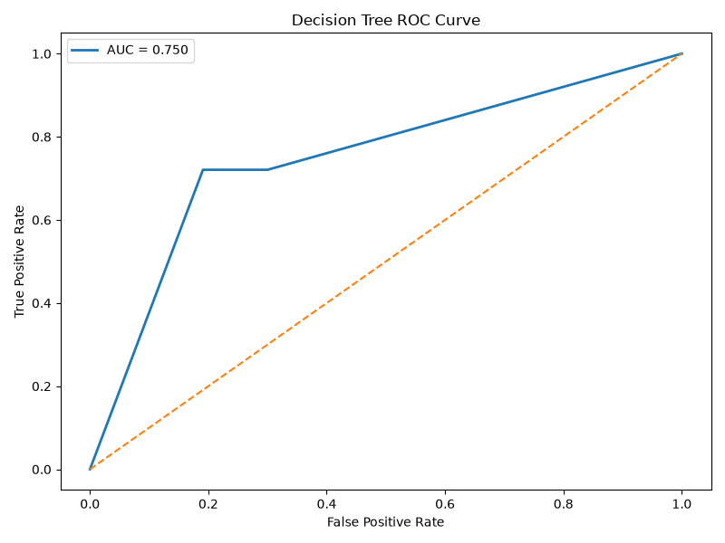
</p>

---

### Random Forest

<p align="center">
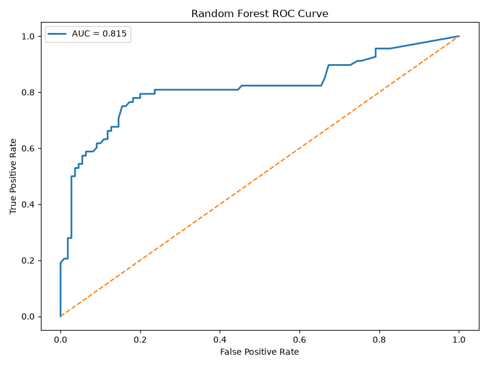
</p>

The ROC curves demonstrate the trade-off between the true positive rate and false positive rate for each classifier across different decision thresholds. The corresponding AUC values summarize each model's overall discriminative ability, with larger values indicating stronger classification performance.

---

# Imbalance Handling

Before model training, the class distribution of the target variable was examined to determine whether class imbalance could influence classifier performance.

Three different strategies were evaluated using Logistic Regression:

| Method | Description |
|---------|-------------|
| Baseline | Original training data without imbalance handling |
| Class Weight | Assign higher importance to the minority class using `class_weight="balanced"` |
| SMOTE | Synthetic Minority Oversampling Technique applied only to the training dataset |

---

## Imbalance Comparison

| Method | Precision | Recall | F1 Score |
|---------|----------:|-------:|---------:|
| Baseline | **0.7833** | **0.6912** | **0.7344** |
| Class Weight | **0.7183** | **0.7500** | **0.7338** |
| SMOTE | **0.7353** | **0.7353** | **0.7353** |

### Conclusion

The three imbalance handling strategies produced comparable overall performance. The baseline model achieved the highest precision, while both **class weighting** and **SMOTE** improved recall by placing greater emphasis on correctly identifying the minority class. Since SMOTE generated a balanced trade-off between precision and recall while avoiding information leakage by operating only on the training data, it provided a robust approach for handling the class imbalance observed in the Titanic dataset.

---

# Hyperparameter Tuning

To improve model performance, **GridSearchCV** was used to perform hyperparameter tuning on the Random Forest classifier. The search evaluated multiple combinations of the following parameters:

- `n_estimators`
- `max_depth`
- `max_features`

Since the assignment required reporting the Out-of-Bag (OOB) score, the Random Forest classifier was constructed with `oob_score=True` throughout the hyperparameter search.

## Best Hyperparameters

| Hyperparameter | Best Value |
|---------------|------------|
| `n_estimators` | **100** |
| `max_depth` | **None** |
| `max_features` | **sqrt** |

## Best Cross-Validation Accuracy

**0.8059**

## Out-of-Bag (OOB) Score

**0.8087**

The GridSearchCV results indicate that a Random Forest containing **100 decision trees**, unrestricted tree depth, and the square-root feature selection strategy produced the strongest cross-validation performance. The corresponding **Out-of-Bag score of 0.8087** closely matches the cross-validation accuracy, suggesting that the tuned model generalizes well without significant overfitting.

---

# Regression Analysis

In addition to classification, a multivariate linear regression model was developed to predict passenger **fare** using the remaining passenger attributes as explanatory variables.

The regression pipeline reused the same preprocessing strategy developed for the classification models, ensuring that numerical and categorical features were consistently processed before training.

## Regression Performance

| Metric | Value |
|---------|------:|
| MAE | **21.1386** |
| RMSE | **41.7465** |
| R² | **0.3468** |
| Adjusted R² | **0.3239** |

---

## Residual Plot

<p align="center">
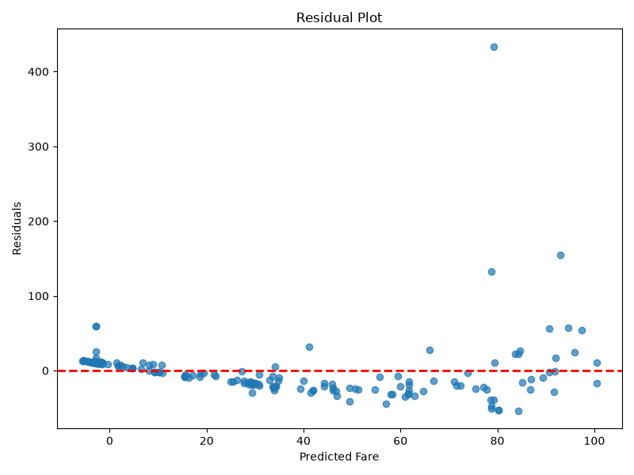
</p>

### Residual Analysis

The residual plot was examined to determine whether the regression model exhibited heteroscedasticity. The residuals do not appear to be randomly distributed around zero and show varying spread across different predicted fare values. This suggests evidence of **heteroscedasticity**, indicating that the variance of the prediction errors is not constant throughout the prediction range. Such behavior is expected because passenger fares are influenced by several complex non-linear factors that cannot be fully captured by a simple linear regression model.

---

# Model Comparison

The classification models were compared using standard classification metrics, while the regression model was evaluated separately using regression-specific metrics.

## Classification Models

| Model | Accuracy | Precision | Recall | F1 Score | AUC |
|--------|---------:|----------:|-------:|---------:|----:|
| Logistic Regression | **0.8090** | **0.7833** | **0.6912** | **0.7344** | **0.8610** |
| Decision Tree | **0.7640** | **0.6806** | **0.7206** | **0.7000** | **0.7496** |
| Random Forest | **0.7865** | **0.7419** | **0.6765** | **0.7077** | **0.8151** |

---

## Regression Model

| Model | MAE | RMSE | R² | Adjusted R² |
|--------|----:|-----:|---:|------------:|
| Linear Regression | **21.1386** | **41.7465** | **0.3468** | **0.3239** |

---

# Model Persistence

The Random Forest machine learning pipeline was serialized using Joblib as a complete Scikit-learn Pipeline. The saved artifact includes both the preprocessing steps and the trained estimator, allowing raw passenger data to be passed directly to the loaded model without requiring manual preprocessing.

```
analytics/models/best_pipeline.joblib
```

The saved pipeline was subsequently reloaded using `joblib.load()` and successfully used to generate predictions directly from raw passenger data. Since preprocessing is embedded within the pipeline, new input data can be passed directly to the loaded model without requiring any manual preprocessing steps.

---

# Project Outputs

Running the analytics module automatically generates the following artifacts.

## Dataset

```text
analytics/data/raw/titanic.csv
analytics/data/processed/titanic_cleaned.csv
```

---

## Trained Models

```text
analytics/models/
├── best_pipeline.joblib
└── best_random_forest.json
```

---

## Generated Visualizations

```text
analytics/outputs/plots/
```

The plots directory contains:

### Part A — Exploratory Data Analysis

- Age Histogram
- Fare Histogram
- Age Box Plot
- Fare Box Plot
- Survival by Sex
- Survival by Passenger Class
- Survival by Sex and Passenger Class
- Correlation Heatmap
- Multivariate Chart 1
- Multivariate Chart 2
- Multivariate Chart 3
- Multivariate Chart 4
- Age Standardization Comparison
- Fare Standardization Comparison

### Part B — Predictive Modeling

- Decision Tree Visualization
- Logistic Regression Confusion Matrix
- Decision Tree Confusion Matrix
- Random Forest Confusion Matrix
- Logistic Regression ROC Curve
- Decision Tree ROC Curve
- Random Forest ROC Curve
- Residual Plot

---

## Generated Reports

```text
analytics/outputs/tables/
├── classification_metrics.csv
├── imbalance_comparison.csv
└── regression_results.csv
```

---

# Technologies Used

- Python
- Pandas
- NumPy
- Matplotlib
- Seaborn
- Scikit-learn
- imbalanced-learn
- Joblib

---

# Module Status

| Task | Status |
|------|:------:|
| Dataset Loading | ✅ |
| Dataset Profiling | ✅ |
| Missing Value Handling | ✅ |
| Exploratory Data Analysis | ✅ |
| Train-Test Split | ✅ |
| Preprocessing Pipeline | ✅ |
| Classification Models | ✅ |
| Model Evaluation | ✅ |
| Imbalance Handling | ✅ |
| Hyperparameter Tuning | ✅ |
| Regression Analysis | ✅ |
| Model Persistence | ✅ |

The Analytics module has been fully implemented and successfully satisfies all the requirements specified in Module 2. The project covers the complete machine learning workflow, beginning with exploratory data analysis and progressing through predictive modeling, evaluation, hyperparameter tuning, regression analysis, and model persistence. All generated artifacts, including visualizations, evaluation reports, trained models, and serialized pipelines, are reproducible through the provided source code and project structure.

---

# Final Recommendation

Among the three classification models evaluated, **Logistic Regression** demonstrated the strongest overall performance on the Titanic dataset, achieving the highest Accuracy (**0.8090**), F1 Score (**0.7344**), and AUC (**0.8610**). Although the Random Forest model benefited from hyperparameter tuning and produced a strong Out-of-Bag (OOB) score of **0.8087**, it did not outperform Logistic Regression on the held-out testing dataset.

Therefore, Logistic Regression would be the preferred deployment model for this dataset due to its superior predictive performance, simplicity, and interpretability. The Random Forest pipeline was additionally saved using Joblib to demonstrate end-to-end pipeline persistence, hyperparameter tuning, and deployment using a complete Scikit-learn Pipeline.